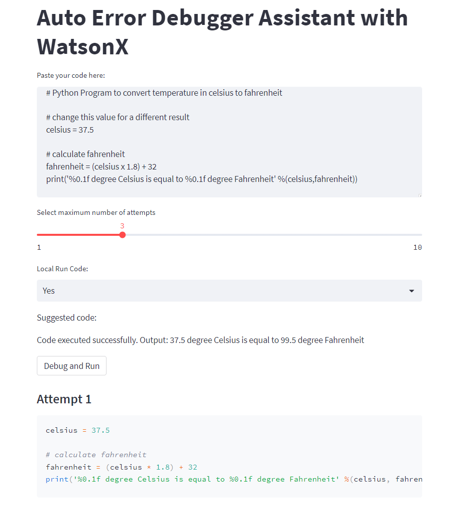
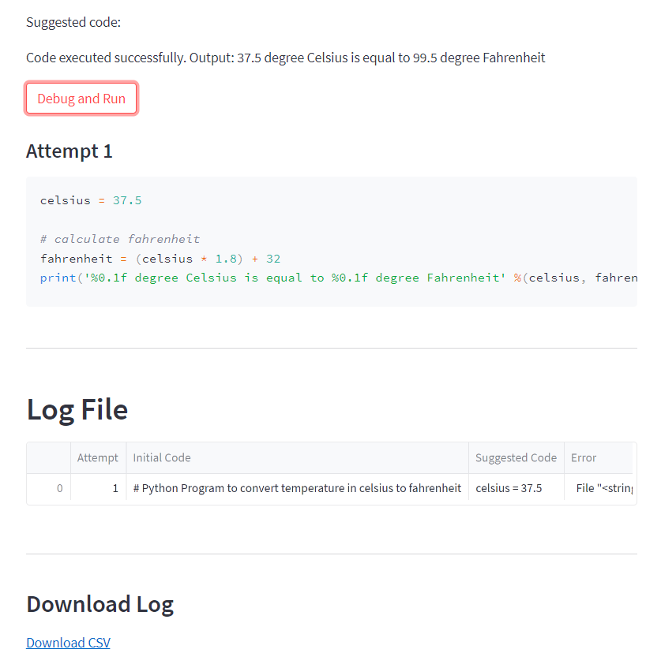

# 🐛 Auto Error Debugger Assistant with WatsonX

[](https://opensource.org/licenses/Apache-2.0)
[](https://www.python.org/downloads/)
[](https://github.com/psf/black)
[](https://github.com/astral-sh/ruff)
[](http://mypy-lang.org/)

An **AI-powered automatic code debugger** that leverages IBM WatsonX foundation models to intelligently analyze, debug, and fix Python code errors in real-time. Built with Streamlit for an intuitive web interface.



## 📋 Table of Contents

- [About](#about)
- [Key Features](#key-features)
- [Architecture](#architecture)
- [Installation](#installation)
  - [Prerequisites](#prerequisites)
  - [Quick Start](#quick-start)
  - [Development Setup](#development-setup)
- [Configuration](#configuration)
- [Usage](#usage)
  - [Running the Application](#running-the-application)
  - [Using the Web Interface](#using-the-web-interface)
  - [Example Workflow](#example-workflow)
- [Development](#development)
  - [Project Structure](#project-structure)
  - [Running Tests](#running-tests)
  - [Code Quality](#code-quality)
- [API Reference](#api-reference)
- [Contributing](#contributing)
- [License](#license)
- [Author](#author)
- [Acknowledgments](#acknowledgments)

## 🎯 About

The **Auto Error Debugger Assistant** is a production-ready application that automates the debugging process by:

1. **Accepting** Python code from users through an intuitive web interface
2. **Executing** the code in a secure subprocess environment
3. **Capturing** any errors or exceptions that occur during execution
4. **Analyzing** the error using IBM WatsonX's advanced AI models
5. **Generating** corrected code suggestions automatically
6. **Iterating** through multiple fix attempts until the code runs successfully
7. **Logging** all attempts with detailed reports for analysis

This tool is ideal for developers, students, and data scientists who want to accelerate their debugging workflow with AI assistance.

## ✨ Key Features

- 🤖 **AI-Powered Debugging**: Leverages IBM WatsonX LLaMA 2 70B model for intelligent code analysis
- 🔄 **Iterative Error Resolution**: Automatically retries with fixes up to a configurable number of attempts
- 🎨 **Modern Web UI**: Beautiful Streamlit interface with real-time feedback
- 📊 **Comprehensive Logging**: Detailed execution logs with CSV export functionality
- 🔒 **Secure Execution**: Code runs in isolated subprocess with timeout protection
- 🎯 **Type-Safe**: Full type hints throughout the codebase
- 📝 **Well-Documented**: Comprehensive docstrings and inline documentation
- ✅ **Production-Ready**: Follows PEP 8, includes tests, linting, and type checking
- 🚀 **Easy Deployment**: Simple setup with modern Python tooling (uv)
- 🔧 **Configurable**: Flexible settings for execution mode and retry limits

## 🏗️ Architecture

```
┌─────────────┐
│   User      │
└──────┬──────┘
       │ Paste Code
       ▼
┌─────────────────┐
│   Streamlit UI  │
└────────┬────────┘
         │
         ▼
┌─────────────────────┐         ┌──────────────────┐
│  Code Executor      │◄───────►│  Error Handler   │
│  (subprocess)       │         └────────┬─────────┘
└─────────────────────┘                  │
                                         ▼
                                ┌────────────────────┐
                                │  WatsonX AI Model  │
                                │  (LLaMA 2 70B)     │
                                └────────┬───────────┘
                                         │
                                         ▼
                                ┌────────────────────┐
                                │  Fixed Code        │
                                └────────────────────┘
```

## 📦 Installation

### Prerequisites

- **Python**: 3.9 or higher (< 3.13)
- **uv**: Modern Python package manager ([Install uv](https://github.com/astral-sh/uv))
- **IBM Cloud Account**: With WatsonX access
- **API Key**: IBM Cloud API key with WatsonX permissions

### Quick Start

1. **Clone the repository**:
```bash
git clone https://github.com/ruslanmv/Autodebugger-with-multiple-chatbots.git
cd Autodebugger-with-multiple-chatbots
```

2. **Install uv** (if not already installed):
```bash
curl -LsSf https://astral.sh/uv/install.sh | sh
```

3. **Install dependencies**:
```bash
make install
```

4. **Configure environment variables**:
```bash
cp .env.example .env
# Edit .env with your IBM Cloud credentials
```

5. **Run the application**:
```bash
make run
```

### Development Setup

For development with all tools (linting, testing, type checking):

```bash
# Install development dependencies
make install-dev

# Or use the initialization command
make init
```

## ⚙️ Configuration

### Environment Variables

Create a `.env` file in the root directory with your IBM Cloud credentials:

```env
# IBM Cloud API Key (required)
API_KEY=your_ibm_cloud_api_key_here

# WatsonX Project ID (required)
PROJECT_ID=your_watsonx_project_id_here

# Optional: IBM Cloud Region (default: us-south)
IBM_CLOUD_REGION=us-south

# Optional: Logging Level (default: INFO)
LOG_LEVEL=INFO
```

### Getting IBM Cloud Credentials

1. **API Key**:
   - Visit [IBM Cloud API Keys](https://cloud.ibm.com/iam/apikeys)
   - Click "Create an IBM Cloud API key"
   - Copy and save the key securely

2. **Project ID**:
   - Go to your [WatsonX Project](https://dataplatform.cloud.ibm.com/projects)
   - Open your project settings
   - Copy the Project ID

## 🚀 Usage

### Running the Application

**Using Make** (recommended):
```bash
make run
```

**Using Streamlit directly**:
```bash
streamlit run autodebugger/app.py
```

**Development mode with auto-reload**:
```bash
make dev
```

The application will open in your default browser at `http://localhost:8501`.

### Using the Web Interface

1. **Paste Your Code**: Enter or paste Python code into the text area
2. **Configure Settings**:
   - Set maximum debug attempts (1-10)
   - Choose execution mode:
     - **Yes**: Execute and debug code
     - **No**: Only get AI code review/optimization
3. **Click "Debug and Run"**: Let AI analyze and fix your code
4. **Review Results**: See execution output and suggested fixes
5. **Download Logs**: Export detailed execution logs as CSV

### Example Workflow

**Input Code** (with intentional error):
```python
# Python Program to convert temperature in celsius to fahrenheit
celsius = 37.5

# Calculate fahrenheit (error: using 'x' instead of '*')
fahrenheit = (celsius x 1.8) + 32
print('%0.1f degree Celsius is equal to %0.1f degree Fahrenheit' %(celsius, fahrenheit))
```

**What Happens**:
1. ❌ First execution fails with `SyntaxError`
2. 🤖 AI analyzes the error
3. ✅ AI suggests fixed code with `*` instead of `x`
4. ✅ Code executes successfully
5. 📊 Log shows all attempts

**Output**:
```
37.5 degree Celsius is equal to 99.5 degree Fahrenheit
```



## 🛠️ Development

### Project Structure

```
autodebugger-watsonx/
├── autodebugger/          # Main package
│   ├── __init__.py        # Package initialization
│   ├── app.py             # Streamlit application
│   └── utils.py           # WatsonX utilities
├── tests/                 # Test suite
│   ├── __init__.py
│   ├── conftest.py        # Pytest fixtures
│   ├── test_app.py        # App tests
│   └── test_utils.py      # Utility tests
├── assets/                # Images and static files
├── backup/                # Legacy versions
├── .env.example           # Environment template
├── .gitignore             # Git ignore patterns
├── LICENSE                # Apache 2.0 license
├── Makefile               # Build automation
├── pyproject.toml         # Project configuration
└── README.md              # This file
```

### Running Tests

**Run all tests**:
```bash
make test
```

**Run tests with coverage**:
```bash
make test-cov
```

**Run fast tests** (without coverage):
```bash
make test-fast
```

**View coverage report**:
Open `htmlcov/index.html` in your browser after running `make test-cov`.

### Code Quality

**Linting**:
```bash
# Check code style
make lint

# Auto-fix issues
make lint-fix
```

**Formatting**:
```bash
# Format code with black and isort
make format

# Check formatting without changes
make format-check
```

**Type Checking**:
```bash
make type-check
```

**Run all checks**:
```bash
make check
```

### Available Make Commands

Run `make help` to see all available commands:

```bash
make help
```

Output:
```
━━━━━━━━━━━━━━━━━━━━━━━━━━━━━━━━━━━━━━━━━━━━━━━━━━━━━━━━━━━━━━━━━━
  Auto Error Debugger Assistant - Makefile Commands
━━━━━━━━━━━━━━━━━━━━━━━━━━━━━━━━━━━━━━━━━━━━━━━━━━━━━━━━━━━━━━━━━━

help                 Show this help message
install              Install production dependencies using uv
install-dev          Install all dependencies including dev tools
sync                 Synchronize dependencies using uv sync
clean                Remove all build, test, coverage artifacts
lint                 Check code style with ruff
lint-fix             Fix code style issues automatically
format               Format code with black and isort
format-check         Check code formatting without changes
type-check           Run type checking with mypy
test                 Run tests with pytest
test-cov             Run tests with coverage report
test-fast            Run tests without coverage
run                  Run the Streamlit application
dev                  Run with auto-reload for development
build                Build distribution packages
check                Run all checks (lint, type-check, tests)
pre-commit           Run pre-commit checks locally
upgrade-deps         Upgrade all dependencies
show-deps            Show installed dependencies
init                 Initialize new development environment
version              Show package version

━━━━━━━━━━━━━━━━━━━━━━━━━━━━━━━━━━━━━━━━━━━━━━━━━━━━━━━━━━━━━━━━━━
```

## 📚 API Reference

### Core Functions

#### `run_code(code: str) -> Tuple[bool, str]`
Execute Python code in a subprocess.

**Parameters**:
- `code`: Python code string to execute

**Returns**:
- `Tuple[bool, str]`: (success_status, output_or_error)

#### `get_chatbot_suggestion(error: str, code: str) -> str`
Get AI-powered code fix suggestion.

**Parameters**:
- `error`: Error message from code execution
- `code`: Original code that produced the error

**Returns**:
- `str`: Suggested fixed code

#### `generate_code(code: str, language: str, message_error: Optional[str]) -> str`
Generate fixed code using WatsonX AI model.

**Parameters**:
- `code`: Code to fix
- `language`: Programming language (default: "Python")
- `message_error`: Optional error message for context

**Returns**:
- `str`: AI-generated fixed code

## 🤝 Contributing

Contributions are welcome! Please follow these guidelines:

1. **Fork** the repository
2. **Create** a feature branch (`git checkout -b feature/amazing-feature`)
3. **Make** your changes following PEP 8 style guidelines
4. **Add** tests for new functionality
5. **Run** quality checks: `make check`
6. **Commit** your changes (`git commit -m 'Add amazing feature'`)
7. **Push** to the branch (`git push origin feature/amazing-feature`)
8. **Open** a Pull Request

### Development Guidelines

- Follow PEP 8 style guidelines
- Add comprehensive docstrings to all functions/classes
- Include type hints for all parameters and return values
- Write tests for new functionality
- Update documentation as needed
- Ensure all checks pass: `make check`

## 📄 License

This project is licensed under the **Apache License 2.0** - see the [LICENSE](LICENSE) file for details.

```
Copyright 2024 Ruslan Magana

Licensed under the Apache License, Version 2.0 (the "License");
you may not use this file except in compliance with the License.
You may obtain a copy of the License at

    http://www.apache.org/licenses/LICENSE-2.0

Unless required by applicable law or agreed to in writing, software
distributed under the License is distributed on an "AS IS" BASIS,
WITHOUT WARRANTIES OR CONDITIONS OF ANY KIND, either express or implied.
See the License for the specific language governing permissions and
limitations under the License.
```

## 👨‍💻 Author

**Ruslan Magana**

- 🌐 Website: [ruslanmv.com](https://ruslanmv.com)
- 💼 LinkedIn: [linkedin.com/in/ruslanmv](https://www.linkedin.com/in/ruslanmv)
- 🐙 GitHub: [@ruslanmv](https://github.com/ruslanmv)
- 📧 Email: contact@ruslanmv.com

## 🙏 Acknowledgments

- **IBM WatsonX** - For providing the powerful AI foundation models
- **Streamlit** - For the excellent web application framework
- **LLaMA 2** - For the advanced language model capabilities
- **Astral** - For the amazing uv package manager
- The open-source community for inspiration and tools

---

<div align="center">

**⭐ If you find this project useful, please consider giving it a star!**

Made with ❤️ by [Ruslan Magana](https://ruslanmv.com)

</div>
